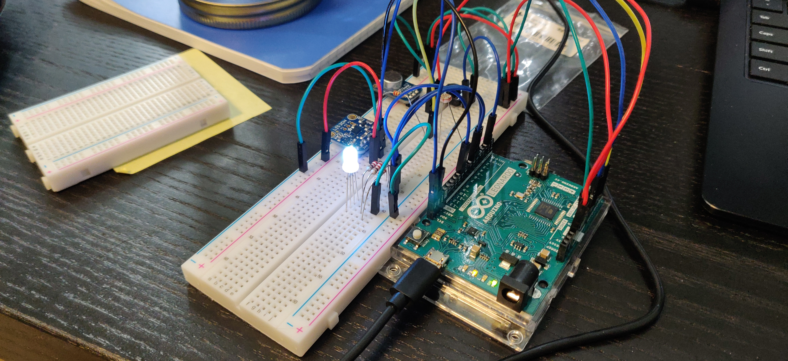

# A nightlight for UW CS 590 A1

Made during the corona scare

Includes:
- Accelerometer
- Microphone
- Capacitive sensor
- Photo-resistor
- Arduino Leonardo

## Modes

The nightlight has five modes:

1. Light sensitive
 The brighter the room is, the brightest the LED
2. Sound sensitive
 It uses FFT to split high, low, and mids and maps them to red, green, and blue.
 This gives a sort of EQ effect.
3. Pitch sensitive
 It uses FFT to figure how far you away in hertz from a note.
4. Capacitive sensitive
 Measures the lid of the mason jar and spins the hue. 
 The more you touch it, the faster it spins.
5. Motion sensitive
 When you tap it, it toggles on and off.
